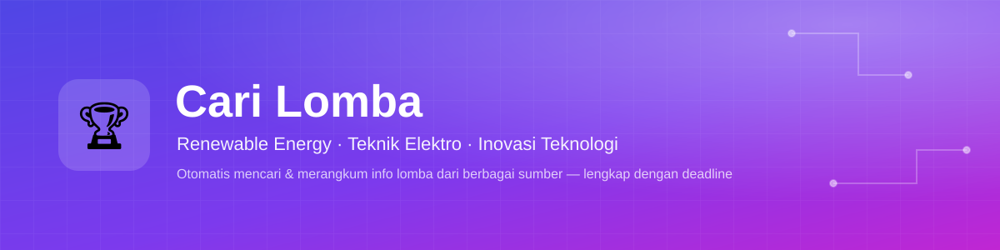
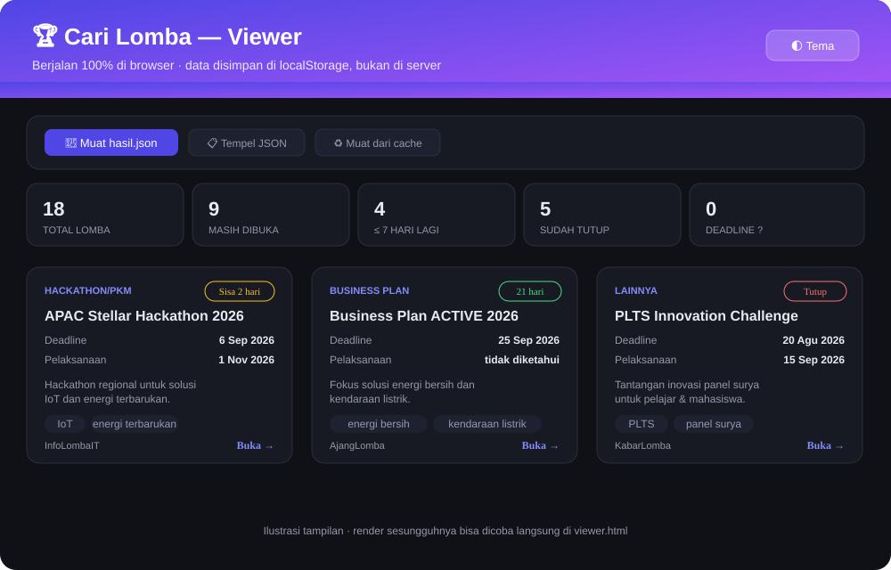

<p align="center">
  
</p>

<h1 align="center">🏆 Cari Lomba</h1>
<p align="center">
  Automatically find <b>renewable energy, electrical engineering, and technology innovation competitions</b><br>
  from multiple sources at once — complete with <b>registration deadlines</b> and <b>event dates</b>.
</p>

<p align="center">
  
  
  
  
  
  
</p>

<p align="center">
  <a href="https://vercel.com/new/clone?repository-url=https://github.com/afprayogi/goleklomba_buatanclaude">
    
  </a>
</p>

<p align="center">
  🇬🇧 English · <a href="README.id.md">🇮🇩 Bahasa Indonesia</a>
</p>

<p align="center">
  <a href="#-features">Features</a> ·
  <a href="#%EF%B8%8F-ui-indexhtml">UI</a> ·
  <a href="#-deploy-to-vercel">Deploy to Vercel</a> ·
  <a href="#-installation">Installation</a> ·
  <a href="#-usage">Usage</a> ·
  <a href="#-privacy--data-security">Privacy</a> ·
  <a href="#-contributing">Contributing</a> ·
  <a href="#-license">License</a>
</p>

---

## ✨ Features

- 🚀 **Web app, ready to deploy on Vercel** — one click on the *Deploy* button above and
  you have your own site. **Zero npm dependencies** (empty `node_modules`), so builds are
  fast and anyone can run it.
- 🔎 **Multiple sources** — Blogger sites (KabarLomba, AjangLomba, BiruLangit,
  InfoLombaIT, Infolomba), public Telegram channels, and (via the CLI) optional Instagram.
- 🌩️ **Server-side scan (Blogger + Telegram together)** — the `/api/scan` endpoint runs
  on Node, so it's *not* limited by browser CORS restrictions. Just click one button on
  the page — no Python install required.
- 🧠 **Two-tier relevance filter** (`strong` / `weak` keywords) so you don't get flooded
  with generic essay/writing competitions that only mention "technology" in passing.
- 📅 **Automatic date parsing** — understands formats like "Deadline: 26 Juli 2026",
  ranges like "26 Juli–9 Agustus 2026", Indonesian month abbreviations, and numeric
  `DD/MM/YYYY` dates.
- 🔁 **Automatic deduplication** — the same competition found across multiple sources is
  merged into one entry.
- 🖥️ **Modern HTML dashboard** — competition cards, category/status filters, instant
  stats, light/dark theme, skeleton loading, toast notifications, and **caching in your
  browser's `localStorage`** (not on any server).
- 📲 **Optional WhatsApp notifications (CLI)** — send new competitions to WhatsApp
  through a local gateway, with dedup so the same competition is never sent twice.
- 🤖 **Claude Code integration** — runnable via the `/cari-lomba` skill, which summarizes
  the results in plain language.
- 🔒 **Privacy-conscious by design** — the server endpoint stores nothing (stateless, it
  only forwards scan results); no personal data (WhatsApp numbers, credentials) lives in
  the example/template files; all sensitive data is already in `.gitignore` *and*
  `.vercelignore`.

---

## 🖥️ UI (`index.html`)

<p align="center">
  
</p>

`index.html` is a single-file dashboard (no framework, no build step) that becomes the
home page once this project is deployed on Vercel — and it still works by opening it
directly on your computer (double-click), no server needed at all. There are three ways
to load data into it:

| Button | Source | Needs a server? |
|---|---|---|
| 🚀 **Scan All Sources** | Blogger *and* Telegram, via `/api/scan` (Node, no CORS limits) | Yes — only active after deployment (or local `vercel dev`) |
| 🌐 **Scan Blogger (in browser)** | Blogger only, directly from browser JavaScript (Blogger's own JSONP) | No — works even when the file is opened directly |
| 📂 **Load file / 📋 Paste JSON** | Output of `python cari_lomba.py --format json` (Instagram included) | No |

The page automatically detects its mode (see the small badge in the header: 🟢 *web
mode* or 🟡 *local mode*) and disables whichever button isn't relevant. Other features:

- 🔍 Search, filter by category (Business Plan, Poster, Hackathon/PKM, etc.), and filter
  by status (still open / closing soon ≤7 days / closed / deadline unknown).
- 📊 Instant summary stats, competition cards with a days-remaining indicator, and an
  "also found on other sources" note for competitions listed on multiple sites.
- 💀 Skeleton loading + a running status message while a server scan is in progress.
- 💾 **Automatically cached in the browser (`localStorage`)** — close and reopen the
  page, and your last scan results are still there.
- 🌗 Light/dark theme (follows system preference, can be toggled manually), mobile
  responsive.
- 🔔 Toast and modal notifications (no more stiff browser `alert()`/`prompt()` dialogs).

Haven't deployed yet? Click **"👀 See an example first"** on the empty state to load
[`demo/hasil-contoh.json`](demo/hasil-contoh.json) instantly, no internet connection
required.

---

## 🚢 Deploy to Vercel

This project has **zero npm dependencies** — `npm install` finishes in seconds, so the
Vercel build is fast too.

### Option 1 — one click

Click the **Deploy with Vercel** button near the top of this README, then follow the
flow (import from your own GitHub, or fork this repo first). Vercel automatically
detects `api/scan.js` as a Serverless Function and `index.html` as the home page — no
extra configuration needed.

### Option 2 — via CLI

```bash
npm i -g vercel      # once, if you've never used the Vercel CLI before
vercel                # deploy a preview
vercel --prod          # deploy to production
```

### Option 3 — try it locally before deploying

```bash
vercel dev
```

This runs `index.html` **and** `/api/scan` at `http://localhost:3000` exactly like
production, so the **"🚀 Scan All Sources"** button is active too (unlike opening
`index.html` directly via `file://`, which automatically restricts itself to
browser-only mode).

**Good to know:**

- `api/scan.js` is set to `maxDuration: 30` seconds in [`vercel.json`](vercel.json). If
  your Vercel plan doesn't allow that duration, lower the number or fall back to the
  "Scan Blogger (in browser)" button.
- `/api/scan` responses are cached on Vercel's CDN for 30 minutes
  (`stale-while-revalidate` for 1 hour) — so repeat visitors get instant results and the
  source sites aren't hit on every page load.
- `.vercelignore` is already set up so `wa_config.yaml`, `wa_sent_history.json`,
  `output/`, and Python files **never get uploaded** when deploying via the CLI from
  your local folder (the CLI doesn't automatically respect `.gitignore`).

---

## 📦 Installation

**Requirements:**

| Requirement | Version | Used for |
|---|---|---|
| Node.js | 18 or newer | Web app + `/api/scan` (zero npm dependencies) |
| Python | 3.9 or newer | CLI (`cari_lomba.py`, full Telegram+Instagram support, WhatsApp notifications) |
| Modern browser | — | Chrome, Edge, Firefox, Safari |
| Local WhatsApp gateway *(optional)* | — | For WhatsApp notifications |

```bash
git clone https://github.com/afprayogi/goleklomba_buatanclaude.git
cd goleklomba_buatanclaude
npm install                    # instant — this project has zero dependencies
pip install -r requirements.txt   # optional, only if you want the Python CLI
```

---

## 🚀 Usage

### 1. Web app (Vercel) — the easiest way

Open your deployed site (see [Deploy to Vercel](#-deploy-to-vercel) if you haven't yet),
click **"🚀 Scan All Sources"**. Done — results (Blogger + Telegram) show up instantly
and are cached in your browser.

### 2. Open it directly from your computer (no server)

Double-click [`index.html`](index.html). The **"🌐 Scan Blogger (in browser)"** button
stays active (Blogger only); for full coverage, use the CLI below and load the results
via **"📂 Load hasil.json file"**.

### 3. Python CLI — the most complete results

```bash
python cari_lomba.py                                    # print as a table in the terminal
python cari_lomba.py --days 30                           # only deadlines within the next 30 days
python cari_lomba.py --keyword "hidrogen"                 # add a one-off keyword filter
python cari_lomba.py --format json --output output/hasil.json
python cari_lomba.py --format csv  --output output/hasil.csv
python cari_lomba.py --include-closed                     # also show competitions with a past deadline
```

Then open [`index.html`](index.html) → click **"📂 Load hasil.json file"** → select
`output/hasil.json` (Instagram included too, once configured).

### 4. Via Claude Code

Type `/cari-lomba` in Claude Code (see
[`.claude/skills/cari-lomba/SKILL.md`](.claude/skills/cari-lomba/SKILL.md)). Claude will
run the same script, summarize the results in plain language, and can help you tweak
keywords/sources interactively.

### 5. Automatic WhatsApp notifications *(optional, CLI)*

```bash
python kirim_info_lomba.py --dry-run   # ALWAYS try this first — preview only, sends nothing
python kirim_info_lomba.py             # actually send
```

Or double-click [`preview_info_lomba.bat`](preview_info_lomba.bat) /
[`kirim_info_lomba.bat`](kirim_info_lomba.bat) on Windows. Gateway setup & dedup details
are in the [Configuration](#%EF%B8%8F-configuration) section.

---

## 🔐 Privacy & Data Security

This project is designed so that **no personal data ever gets shared**:

- `wa_config.yaml` (your real WhatsApp number & gateway credentials) **is already in
  `.gitignore` and `.vercelignore`** — it will never be accidentally committed to git or
  uploaded to Vercel.
- The only file committed to the repo is
  [`wa_config.example.yaml`](wa_config.example.yaml), an empty template with a
  placeholder (`628xxxxxxxxxx@s.whatsapp.net`), not a real number.
- The WhatsApp gateway used **runs locally on your own computer**
  (`http://localhost:3000`), not a third-party service — its credentials never leave
  your computer, and it has nothing to do with the Vercel deployment.
- `wa_sent_history.json` (send history) and the `output/` folder are also in
  `.gitignore` + `.vercelignore` since they contain your personal run data.
- Instagram **never** handles your password — login is done manually via
  `instaloader --login=...` in your own terminal (a CLI-only feature, not part of the
  Vercel deployment).
- **`/api/scan` is stateless** — there's no database, and it doesn't store who made a
  request or what they searched for. It only forwards (and briefly CDN-caches) scan
  results from public sites, whose data is already public.
- `index.html` doesn't send anything to any third party besides (a) `/api/scan` on your
  own Vercel domain, or (b) the competition source sites when the "Scan Blogger (in
  browser)" button is pressed. Displayed data is only stored in your device's
  `localStorage`.

**Before pushing to a public repo / deploying from the CLI**, double-check:

```bash
git status   # make sure wa_config.yaml does NOT appear in the files to be committed
```

---

## ⚙️ Configuration

All sources & keywords for the CLI are configured in [`config.yaml`](config.yaml). For
the web app (`/api/scan` and "Scan Blogger in browser" mode), sources & keywords live in
[`lib/lomba-core.js`](lib/lomba-core.js) and inside `index.html` — deliberately copied
by hand (instead of reading `config.yaml` at runtime) so this project stays **zero
dependency** (no extra YAML parser). If you change one, keep the other in sync.

| Source | How it's fetched | Notes |
|---|---|---|
| [kabarlomba.com](https://www.kabarlomba.com), [ajanglomba.com](https://www.ajanglomba.com), [birulangit.id](https://www.birulangit.id), [infolombait.com](https://www.infolombait.com), etc. | Blogger's built-in JSON API (`/feeds/posts/default`) | No fragile HTML scraping — officially provided by the Blogger platform |
| Public Telegram: `@informasilomba`, `@edulantern`, `@infolomba_ofc`, etc. | `t.me/s/<channel>` (public preview page, no login) | Works in the CLI & `/api/scan` (server); not possible from the browser (CORS) |
| Instagram *(optional, CLI only)* | [instaloader](https://github.com/instaloader/instaloader) | Requires manual login, risks rate-limiting from Meta |

### WhatsApp notifications (CLI)

1. Copy the template: `cp wa_config.example.yaml wa_config.yaml` (already present by default).
2. Fill in `recipients.personal` / `recipients.groups` with **your own** target number(s)/group(s).
3. Run the local WhatsApp gateway at `http://localhost:3000` (or adjust `gateway.base_url`).
4. Always try `--dry-run` first before sending for real.

Schedule it automatically (e.g. every morning) via Windows Task Scheduler / `cron`:
`python cari_lomba.py` then `python kirim_info_lomba.py`.

---

## 🧠 How the Relevance Filter Works

To avoid being flooded with generic essay/writing competitions that only mention
"technology" or "innovation" in passing, filtering happens in two tiers:

- **strong** — if any of these appear (e.g. "elektro", "energi terbarukan", "IoT",
  "smart grid"), the competition is immediately considered relevant.
- **weak** — generic words (e.g. "teknologi", "inovasi") are only treated as a relevance
  signal if **≥2 different weak words** appear **AND at least one of them is in the
  title** (not just the article body).

Results from multiple sources that turn out to be the same competition are automatically
merged (deduplicated based on title similarity & link).

---

## 📁 Project Structure

```
cari-lomba/
├── index.html                # Web app (dashboard + scan) — home page on Vercel
├── api/scan.js                # Serverless Function: GET /api/scan (Blogger + Telegram)
├── lib/lomba-core.js          # Core logic (filtering, date parsing, dedup) — used by api/scan.js
├── vercel.json                 # Vercel config (function maxDuration, etc.)
├── .vercelignore                # Prevents personal files from being uploaded on CLI deploy
├── package.json                 # Zero npm dependencies — instant install
│
├── cari_lomba.py              # Python CLI: search, filter, parse dates, dedup (most complete)
├── kirim_info_lomba.py        # Send new competitions to WhatsApp (optional, CLI)
├── config.yaml                 # Sources & keywords for the CLI
├── requirements.txt
│
├── wa_config.example.yaml     # WhatsApp config template (safe to commit)
├── wa_config.yaml              # Your real WhatsApp config (gitignored & vercelignored)
├── demo/hasil-contoh.json     # Example data to try index.html without running anything
├── output/                     # CLI export output (gitignored & vercelignored)
├── .claude/skills/cari-lomba/  # Claude Code skill (/cari-lomba)
├── assets/                      # README image assets
├── LICENSE
├── CONTRIBUTING.md
├── README.md                    # English version (this file)
└── README.id.md                 # Indonesian version
```

---

## ⚠️ Limitations

- **Deadlines aren't always found.** If the date only appears in an image/infographic
  (not text), the deadline field will be empty — check the given link directly.
- **`/api/scan` fetches each site's latest posts** (rather than one request per keyword
  like the CLI) to stay fast and light within serverless time limits. For the most
  complete coverage (including older competitions that rarely show up in the latest
  feed), use `python cari_lomba.py`.
- **Instagram/X** beyond the configured accounts can't be reliably automated without a
  paid API, and is only available via the CLI (not part of the Vercel deployment).
- **The in-browser scan** ("Scan Blogger" mode) is a simplified JavaScript port: no
  automatic retries, and deduplication uses a lighter title-similarity calculation
  (not Python's exact `difflib`).

---

## 🤝 Contributing

Any contribution — bug reports, source/keyword ideas, or pull requests — is very
welcome. Read [`CONTRIBUTING.md`](CONTRIBUTING.md) for the full guide, including the
areas that need the most help.

Quick steps:

1. Fork this repo & create a new branch.
2. To add CLI sources/keywords, just edit [`config.yaml`](config.yaml). For the web app,
   also keep [`lib/lomba-core.js`](lib/lomba-core.js) and `index.html` in sync.
3. Open a Pull Request with a short explanation of why the change is needed.

---

## 📄 License

This project is licensed under the [MIT License](LICENSE) — free to use, modify, and
redistribute, including for commercial purposes, as long as the original license notice
is included.

---

## 🙏 Disclaimer

This tool does light scraping of public sites (Blogger, Telegram) that already provide
competition info openly. Use it reasonably so as not to burden the source sites —
`/api/scan` responses are already cached on Vercel's CDN for 30 minutes for this reason.
The Instagram feature is optional and fully the user's responsibility with regard to
Meta's Terms of Service.

<p align="center">Built to help fellow students find competition info faster. Good luck out there! 🚀</p>
